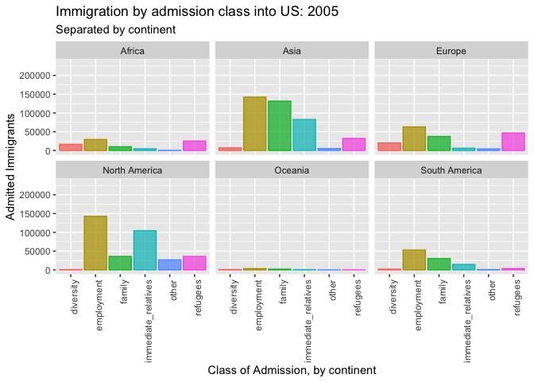

# Raw data source
The visualization in this Milestone makes use of the data below:

Homeland Security - Immigration by Continent by Year
https://www.dhs.gov/immigration-statistics/yearbook

I first downloaded table10D(legal immigration by origin by year) data for year 2005 - 2017 (custom data before 2005 was organized and ordered using different methods, and therefore was not incorporated in this project). Then I organized the by continent data into one xlsx, which I am using here for this project.

In the future, I will combine data from American Fact Finder(US Census Bureau).

```{r setup, include=FALSE}
knitr::opts_chunk$set(echo = TRUE)
#No compliation

library(readxl)
library(ggplot2)
library(readxl)
library(janitor)
library(gifski)
library(gganimate)
library(data.table)
library(tidyverse)

#load the immigration by continent data
#clean up names and values

immigration_continent <- read_xlsx("raw_data/immigration_yearbook/Immigration_ByContinent.xlsx") %>%
  clean_names()

```

# Visualizaiton
```{r visualization, echo = FALSE}
#make a ggplot representing the immigration change to America during 2005 - 2017
#split by admission class and continent


#Cleanup the data for graphing
#Remove total count
#Reformat year column from double to integer for frame_time display
immigration_7continents <- immigration_continent %>%
     filter(region %in% c("Africa", "Asia", "Europe", "North America", "Oceania", "South America")) %>%
    mutate(year = as.integer(year))

#Rename columns
setnames(immigration_7continents, "immediate_relatives_of_u_s_citizens", "immediate_relatives")

setnames(immigration_7continents, "family_sponsored_preferences", "family")

setnames(immigration_7continents, "employment_based_preferences", "employment")

setnames(immigration_7continents, "refugees_and_asylees", "refugees")

#Reformat data from short form to long form
immigration_7continents_long <- immigration_7continents %>%
      select(region, year, immediate_relatives, family,employment, diversity, refugees, other) %>%
      gather(key = "admission_class", value = "count", immediate_relatives: other)
          

#Create a ggplot to show animated bar chart: immigration count and time transition
#Split by class of admission and continent
  graph <- ggplot(immigration_7continents_long, aes(x = admission_class, y = count, color = admission_class, fill = admission_class)) +
 geom_col(alpha = 0.75) +
 facet_wrap(~region) +
 transition_time(year) +
 theme(legend.position = "none") +
 labs(title = "Immigration by admission class into US: {(frame_time)}", subtitle = "Separated by continent", y = "Admitted Immigrants", x = "Class of Admission, by continent" ) +
 theme(axis.text.x = element_text(angle = 90, hjust = 1)) 

#save the gif 
anim_save("graph.gif", graph)
```

<!--render the gif image-->


#Observations 1 :There are shifts in both total immigration count and admission class into US from the major continents. The next step will be to design a data dashboard that showcase both the overall trend and segmented patterns, and to connect immigration admission data with US Census Bureau social economic data. 

#Observation 2: The gganimate graph is slow to render, and might be hard for user to digest information(even though it looks cool!) Therefore, I will see what's the capability for Shiny package, and may use a slider instead. 


